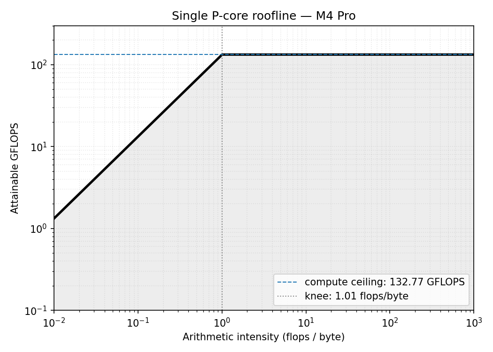

# 00 - Machine Baseline (M4 Pro)

## Hardware
- MacBook Pro, Apple M4 Pro, 48 GB LPDDR5X-8533
- macOS 26.2 (Build 25C56)
- 10 P-cores (2 clusters × 5) + 4 E-cores = 14 total
- P-core max boost: ~4.51 GHz (observed via powermetrics)

## Why this write up exists
Before optimizing any kernel I need three numbers as denominators to calculate "% of peak". They are the single-core FP32 compute ceiling, the single-core sustained DRAM bandwidth, and the cache hierarchy sizes. The first two I measure and the third I cite (for reasons the cache_sweep section explains).

## Measurement 1: peak FP32 throughput (peak_fma)
**Hypothesis** - With 4 NEON FMA pipes x 4 lanes x 2 FLOPs / FMA x 4.5 GHz the theoretical ceiling is ~144 GFLOPS per core. With 16 independent accumulator chains I expect to hide the 3-cycle FMA latency and get within 10% of that.

**Method**
We run a tight loop of 200 million iterations, and inside each iteration issue 16 vector fused-multiply-add (`vfmaq_f32`) instructions. We verify that we see 16 fmla instructions per loop body with no register spills by looking at the assembly.

We also prevent the compiler from "deleting" the work by using the accumulator to calculate a sum and write it through a volatile sink.

```cpp
constexpr int CHAINS = 16;
constexpr long long ITERS = 200'000'000LL;

static void peak_fma_kernel() {
  float32x4_t acc[CHAINS];
  for (int i = 0; i < CHAINS; ++i) acc[i] = vdupq_n_f32(1.0f);
  const float32x4_t a = vdupq_n_f32(1.0000001f);
  const float32x4_t b = vdupq_n_f32(0.9999999f);

  for (long long k = 0; k < ITERS; k++) {
    for (int i = 0; i < CHAINS; i++) {
      acc[i] = vfmaq_f32(acc[i], a, b);
    }
  }

  float32x4_t s = acc[0];
  for (int i = 1; i < CHAINS; ++i) s = vaddq_f32(s, acc[i]);
  asm volatile("" : : "w"(s));
}
```

**Result**
- 132.77 GFLOPS (min) which is 92% of the theoretical peak. 
- Run-to-run spread: min 192.8 ms vs p99 195.1 ms = 1.2%. So it's stable.

Disassembly shows the inner loop body contains
- 16 consecutive `fmla.4s ...` writing to 16 different registers (independent instructions)
- 2 instructions of loop overhead
- zero `mov v.., v..` spills (good because spills are wasted load/store cycles)

So the total useful work to total instructions ratio is 16/18, about 89%. This is close to the observed 92% of achieved FLOPS.

## Measurement 2: peak streaming bandwidth (STREAM-Triad)
**Hypothesis** - The operation `A[i] = B[i] + s * C[i]` should be memory bound if it's linearly done over 256MB arrays (way over the L2 limit of 16MiB). Single-core M4 Pro bandwidth is unknown to me beforehand so naively extrapolating from older M1/M2 measurements and 273 GB/s aggregate bandwidth of M4 Pro, I predict 100-120 GB/s.

**Method**
We setup 64M floats per array and perform two FLOPs and two reads and one write in each iteration. The hardware adds a 4th implicit read of A's elements due to write-allocate strategy.

```cpp
constexpr size_t N = 64 * 1024 * 1024;  // 64M floats = 256 MB
static void triad() {
    const float s = 3.0f;
    float* __restrict a = A;
    const float* __restrict b = B;
    const float* __restrict c = C;
    for (size_t i = 0; i < N; ++i) {
        a[i] = b[i] + s * c[i];
    }
}
```

The restrict qualifier promises the compiler that A, B, C don't alias (no memory overlap) which is required for autovectorization (stores to A shouldn't block future load from B or C).

**Result**
131.86 GB/s (min) with run-to-run spread of min 6107 ns vs p99 6505 ns = ~6.5%. This is higher than my prediction of 100-120 GB/s. 

Looking at the assembly showed that Clang unrolled the loop by 4x. So per iteration, there are
- 4x `ldp` loading from B and C
- 4x `fmla.4s` computing b + s*c
- 2x `stp` storing results to A

> `ldp` loads a pair of 128-bit vector registers in one instruction. That's 8 floats in total. `fmla.4s` is fused multiply accumulate on 4 floats at a time. Multiply and add happen in one instruction so it's both efficient and accurate (single rounding step). `stp` stores a pair of 128-bit registers to memory but reads from L2/DRAM first if not already in L1D cache. It modifies the cached copy and then marks dirty which is written to DRAM later when evicted.

So yeah the kernel is memory-bound with tiny arithmetic intensity and the measured bandwidth of 131.86 GB/s will be used as the single-core DRAM ceiling.

## Measurement 3: cache hierarchy (cache_sweep)
**Hypothesis** - Sweeping a strided sum over buffer sizes from 16 KB to 256 MB should reveal three plateaus at L1, L2, and DRAM bandwidths. From the cliffs I should be able to read off cache sizes empirically.

**Method** - `sum_buffer` with 4 scalar accumulators so that reduction isn't bottlenecked by the latency of each individual add. We have repeated sweeps making each call long enough to time. Buffer sizes: 16 KB, 64 KB, 192 KB, 1 MB, 4 MB, 16 MB, 64 MB, 256 MB.

```cpp
static float sum_buffer(const float* __restrict p, size_t n) {
  float a0 = 0, a1 = 0, a2 = 0, a3 = 0;
  for (size_t i = 0; i < n; i += 4) {
    a0 += p[i + 0];
    a1 += p[i + 1];
    a2 += p[i + 2];
    a3 += p[i + 3];
  }
  return (a0 + a1) + (a2 + a3);
}
```
**Result**
No cliffs are visible in the resulting plot. The curve is roughly flat at 80-95 GB/s across all sizes with a small downward slope towards DRAM.

My hypothesis was wrong as I expected three clear plateaus.
1. The kernel is compute-bound? We have four accumulator chains with each accumulate taking 3 cycles which gives 4/3=1.33 accumulates per cycle. So the kernel is consuming 1.33 fadds / cycle * 4 bytes / fadd * 4.5 GHz = 24 GB/s and if the compiler further autovectorized the inner loop turning individual accumulators into `fadd.4s` (4 floats at once) that gives 96 GB/s. So the kernel is probably hitting the compute ceiling (96 GB/s) before it hits the memory ceiling (132 GB/s)
2. The prefetcher hides DRAM latency. The strict unit-stride access pattern lets the prefetcher lock on immediately and pull cache lines from DRAM into L1 ahead of the actual reads. Combined with point 1, even the 256 MB case only drops 15% below the L1 case.

The 16 KB outlier (74 GB/s) is probably due to the per-call overhead being not as amortized as it is for larger buffers.

**What would have worked**
To reveal cache cliffs, you'd need either a) a NEON-vectorized kernel with enough accumulators to lift the compute floor above 200GB/s so memory becomes the ceiling for the kernel across all memory bandwidths or b) a random-access / linked-list style pointer chasing that defeats the hardware prefetcher.

I didn't try this and instead paste below the cache sizes documented by Apple:

**Cache hierarchy (Apple Silicon CPU Optimization Guide v4.0, Tables 5.24 / 5.27 / 5.29; confirmed via `sysctl hw.perflevel0.*`):**

| Level | Capacity | Associativity | Line size | Latency |
|-------|----------|---------------|-----------|---------|
| L1D | 128 KiB per P-core | 8-way | 64 B | 4 cycles |
| L2 | 16 MiB shared / 5 P-cores | 16-way | 128 B | ~15 cycles |
| M-Cache (SLC) | 24 MiB chip-wide (M4 Pro) | 12-way | 128 B | ~35 ns |
| DRAM | 48 GB | — | — | ~95 ns |

Note: `hw.cachelinesize = 128` reports the L2/coherence line size. The L1D
internally operates on 64B lines (§5.6.3). An unaligned load crossing a 64B
boundary can incur a penalty; crossing a page boundary (16 KiB) is worse.

Topology: 10 P-cores (2 clusters × 5) + 4 E-cores = 14 total.

## Roofline plot

There are two ceilings that define what's achievable:
- Compute roof: 132.77 GFLOPS  (flat, at arithmetic intensity > 1.01 flops/byte)
- Memory roof: 131.86 GB/s (slope, at arithmetic intensity < 1.01 flops/byte)

The knee is unusally low compared to x86 machines because Apple Silicon has high single-core bandwidth relative to NEON compute so any kernel with more than 1 flop per byte of movement is compute-bound on this hardware.

## What this means for our kernels

### SGEMM
For square NxN matrix multiply, C = A @ B

- Minimum FLOPs required = 2N^3 flops
- Minimum bytes moved = 12N^2 bytes
- Arithmetic intensity = N/6

When N=1024, the intensity is ~170 flops/byte which is way above the knee, so the roofline says SGEMM is compute-bound meaning the limiting ceiling is the compute roof (132.77 GFLOPS).

Also note that N/6 is arithmetic intensity assuming perfect data reuse (we read every element exactly once) so naive implementation, which is far from having perfect reuse, will not achieve the compute ceiling.

### Prefix Sum
For prefix sum `out[i] = out[i-1] + in[i]`
- Minimum FLOPs required = N flops
- Minimum bytes moved = 8N bytes
- Arithmetic intensity = 0.125 flops/byte

The intensity is independent of the input size and is below the knee meaning prefix sum is memory-bound.

For memory bound kernel, we measure success in GB/s (how fast you feed data), because compute isn't the bottleneck.

## Going Forward

The targets I have set for this exercise is to achieve 50% of the peak.

For SGEMM, this means achieving ~66 GFLOPS and for Prefix Sum it's ~66 GB/s. Each kernel is measured against the ceiling that actually limits it.
